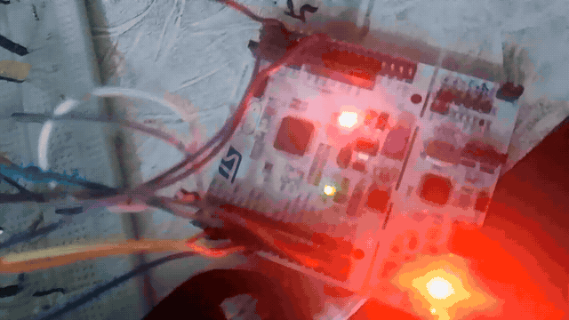
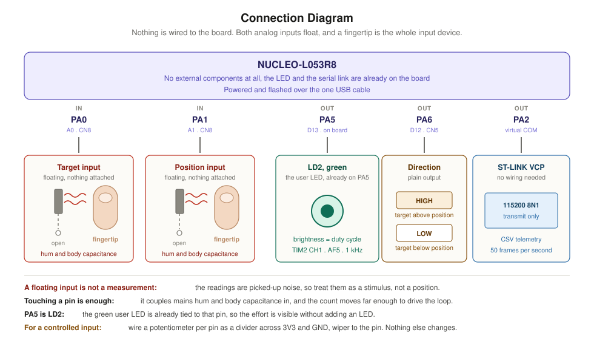
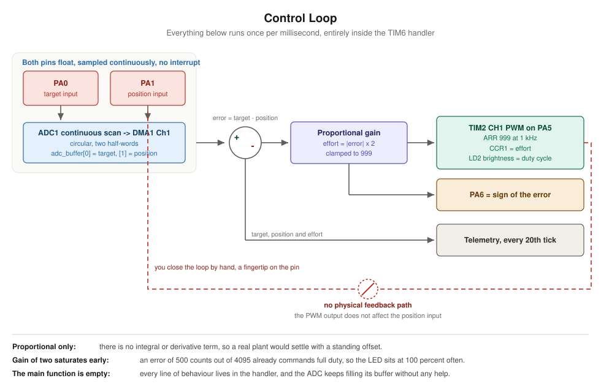
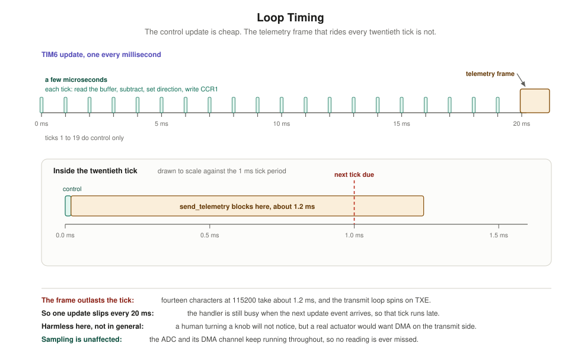
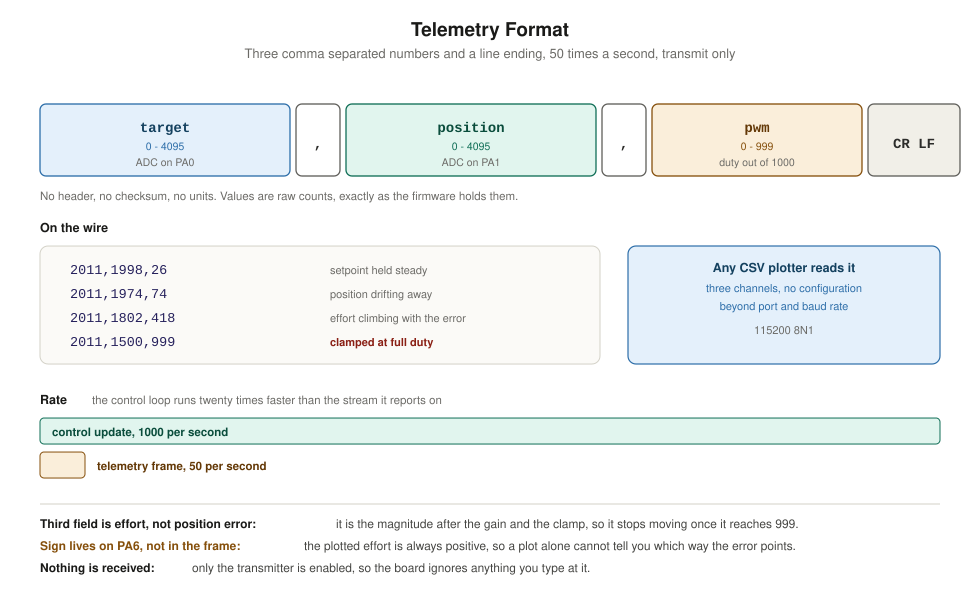

# STM32 Nucleo-L053R8 — Proportional Control Loop

A bare-metal (register-level) STM32 project for the **NUCLEO-L053R8** board
(STM32L053R8, Cortex-M0+). Two potentiometers stand in for a setpoint and a
position sensor. A proportional controller runs a thousand times a second,
drives the on-board LED with the resulting effort, and streams target, position
and effort out of the serial port as comma separated values.

The ADC fills its buffer by DMA without ever raising an interrupt, and `main()`
is an empty loop. Every line of behaviour lives in one timer handler.

## Demo

Turning the target potentiometer moves the setpoint away from the position
input. The error grows, the effort follows it, and all three channels scroll
past in a serial plotter.



## Hardware

Only the two potentiometers need wiring. The LED and the serial link are
already on the board.

| Pin | Direction | Role                                         |
|-----|-----------|----------------------------------------------|
| PA0 | in        | target potentiometer wiper, ADC channel 0    |
| PA1 | in        | position potentiometer wiper, ADC channel 1  |
| PA5 | out       | PWM effort, TIM2 channel 1 — this is LD2     |
| PA6 | out       | direction, high when the target is above     |
| PA2 | out       | telemetry, USART2 TX to the ST-LINK COM port |



Both pots are ordinary dividers: outer legs to 3V3 and GND, wiper to the analog
pin. Anything from about 1 kΩ to 100 kΩ works.

## Control loop

The whole controller is four lines of arithmetic. Subtract position from
target, take the sign for the direction pin, scale the magnitude by two, and
clamp it to the PWM period.



**The loop is not closed through physics.** Nothing in the circuit connects the
PWM output back to the position input — that pot is turned by hand. So this
demonstrates the controller, not a servo: you play the part of the plant.

Two consequences worth knowing before reading the traces:

- There is no integral or derivative term, so against a real plant this would
  settle with a standing offset.
- A gain of two saturates early. An error of 500 counts out of 4095 already
  commands full duty, so the LED sits at 100 percent over most of the range.

## Loop timing

The control update itself costs a few microseconds. The telemetry frame that
rides every twentieth tick costs far more, because the transmit path is a
polled loop rather than DMA.



Fourteen characters at 115200 baud occupy the line for about 1.2 ms, which is
longer than the 1 ms tick period. The handler is therefore still transmitting
when the next update event arrives, and that one tick runs late. It happens
once every 20 ms and a hand-turned knob will never notice, but it is the first
thing to fix if this drove a real actuator.

Sampling is unaffected either way: the ADC and its DMA channel keep running
throughout, so no reading is lost.

## Telemetry

One line per frame, fifty frames a second, transmit only. No header, no
checksum, no units — the values are raw counts exactly as the firmware holds
them.

```
target,position,pwm<CR><LF>
```



Open the ST-LINK virtual COM port at **115200 8N1** in any CSV plotter and
three channels appear with no further configuration. The clip above uses
Serial Studio in quick plot mode.

The third field is the effort after the gain and the clamp, not the raw error,
so it stops moving once it reaches 999. The sign of the error goes to PA6 and
never appears in the frame, which means a plot alone cannot tell you which
direction the controller is pushing.

## Peripheral map

| Peripheral | Role              | Configuration                                     |
|------------|-------------------|---------------------------------------------------|
| ADC1       | samples both pots | continuous scan of channels 0 and 1, DMA circular |
| DMA1 Ch1   | moves results     | circular, two half-words, no interrupt            |
| TIM2       | PWM output        | PSC 31, ARR 999 — 1 kHz on channel 1, PA5, AF5    |
| TIM6       | control tick      | PSC 31, ARR 999 — 1 kHz interrupt                 |
| USART2     | telemetry         | 115200 8N1, transmit only, polled                 |

SYSCLK is 32 MHz, the part's maximum, taken from the internal HSI16 through the
PLL at ×4 ÷2. Voltage scaling range 1 and one flash wait state are set before
the clock is raised.

One detail worth flagging for anyone reusing the ADC setup: the code writes
`ADSTART` immediately after `ADEN` rather than waiting for `ADRDY` first. It
works on this board, but the reference manual asks for the wait.

## Building

Open the project in **STM32CubeIDE** and build, or flash the resulting ELF with
your preferred tool. Source of interest: [`Core/Src/main.c`](Core/Src/main.c).

```
   text    data     bss     dec     hex
   2276       4    1644    3924     f54
```

The `Debug/` build output and IDE `*.launch` files are intentionally excluded
from version control.

## Repository layout

| Path                     | Contents                                           |
|--------------------------|----------------------------------------------------|
| `Core/Src/main.c`        | the entire application — ADC, control, PWM, output |
| `Core/Startup/`          | vector table and reset handler                     |
| `Drivers/`               | vendored ST HAL and CMSIS headers                  |
| `docs/`                  | diagrams used by this README                       |
| `STM32L053R8TX_FLASH.ld` | linker script                                      |

## Related

The same board and the same register-level approach, earlier in the series:

- [stm32-nucleo-l053r8-random-binary-display](https://github.com/tathagata48/stm32-nucleo-l053r8-random-binary-display)
  — LEDs show a random number in binary on a button press.
- [stm32-nucleo-l053r8-usart-led-control](https://github.com/tathagata48/stm32-nucleo-l053r8-usart-led-control)
  — an interrupt-driven serial command protocol driving an 8-LED array.
- [stm32-nucleo-l053r8-dac-sine-generator](https://github.com/tathagata48/stm32-nucleo-l053r8-dac-sine-generator)
  — a timer-paced DAC sine wave, tuned live over a DMA-driven serial link.

## License

This project's own code is released under the [MIT License](LICENSE).

The vendored STMicroelectronics HAL and CMSIS sources under `Drivers/` are
distributed under their respective ST / Arm licenses (see the `LICENSE.txt`
and `License.md` files within those folders).
